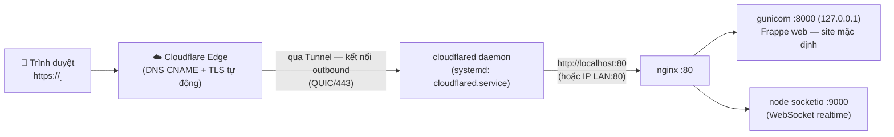

# Runbook — Gán domain Cloudflare vào máy chủ nội bộ bằng Cloudflare Tunnel

> **Dành cho AI agent & người vận hành.** Runbook này được viết lại từ một lần deploy **thành công thật** trên máy ERP-HR ngày **2026-08-24** (cloudflared 2026.8.2, Ubuntu 22.04 jammy, Frappe v15 bench, tunnel ID `9637e533-2e96-46d7-bd71-ae63d1b5fd64`, 4 kết nối QUIC đến edge HKG). Làm theo đúng thứ tự các bước; mỗi bước có lệnh verify — **không sang bước sau khi verify chưa đạt**.

## 0. Mục đích & khi nào dùng runbook này

- Muốn truy cập một web server trong LAN nội bộ (ví dụ `http://192.168.2.116/`) bằng domain thật `https://<sub>.<domain>` mà **không mở port router, không cần public IP**.
- Domain đã nằm trong tài khoản Cloudflare (zone **Active**, nameserver trỏ về Cloudflare).
- Đã tạo tunnel trên **Zero Trust → Networks → Tunnels** và có **token** dạng chuỗi `eyJ...`.

### Kiến trúc



Điểm mấu chốt: `cloudflared` **tự tạo kết nối outbound** đến Cloudflare. DNS chỉ cần một CNAME trỏ về `<tunnel-id>.cfargotunnel.com` (Cloudflare tự tạo ở bước 4).

### Thông tin máy ERP-HR (đã verify 2026-08-24)

| Thành phần | Giá trị |
|---|---|
| Máy chủ / IP LAN | `192.168.2.116` (hostname `ERP-HR`), Ubuntu 22.04 |
| Frappe bench | `/home/frappe/frappe-bench`, site mặc định `erp-hr.local` |
| nginx | lắng nghe `0.0.0.0:80`, conf bench tại `frappe-bench/config/nginx.conf` (đã link vào `/etc/nginx/conf.d/frappe-bench.conf`) |
| gunicorn | `127.0.0.1:8000` |
| socketio (node) | `:9000` |
| Site config then chốt | `sites/common_site_config.json`: `"dns_multitenant": false`, `"serve_default_site": true`, `"default_site": "erp-hr.local"` |
| Tunnel | ID `9637e533-2e96-46d7-bd71-ae63d1b5fd64`, token lưu tại `/etc/cloudflared/token` |

> ⚠️ **TUYỆT ĐỐI KHÔNG** ghi token thật (`eyJ...`) vào bất kỳ file nào của repo, log, hay chat công khai. Token cho phép bất kỳ ai gắn connector vào tunnel của bạn. Trong runbook này luôn dùng placeholder `<TUNNEL_TOKEN>`.

## 1. Audit môi trường trước khi làm gì

```bash
# cloudflared đã cài chưa?
which cloudflared; cloudflared --version

# Cổng nào thật sự đang phục vụ web? (quan trọng: đừng đoán)
sudo ss -tlnp | grep -E ':(80|8000|9000)\b'

# Origin có trả 200 không?
curl -sI --max-time 5 http://192.168.2.116/ | head -n 8
```

Kết quả mong đợi trên máy ERP-HR: nginx `0.0.0.0:80`, gunicorn `127.0.0.1:8000`, node `*:9000`, curl trả `HTTP/1.1 200 OK`. **Service URL của tunnel phải trỏ vào port nginx (80)** — không phải 8000 (chỉ bind localhost) — vì cloudflared cần gọi qua HTTP rõ ràng và nginx đã proxy đủ web + `/socket.io`.

## 2. Cài cloudflared (apt repo chính thức)

```bash
# Add cloudflare gpg key
sudo mkdir -p --mode=0755 /usr/share/keyrings
curl -fsSL https://pkg.cloudflare.com/cloudflare-public-v2.gpg | sudo tee /usr/share/keyrings/cloudflare-public-v2.gpg >/dev/null

# Add repo
echo 'deb [signed-by=/usr/share/keyrings/cloudflare-public-v2.gpg] https://pkg.cloudflare.com/cloudflared any main' | sudo tee /etc/apt/sources.list.d/cloudflared.list

# Update RIÊNG repo cloudflared rồi cài
sudo apt-get update -o Dir::Etc::sourcelist="sources.list.d/cloudflared.list" -o Dir::Etc::sourceparts="-" -o APT::Get::List-Cleanup="0" \
  && sudo apt-get install -y cloudflared \
  && cloudflared --version
```

> **Bài học (đã gặp trên máy này):** `sudo apt-get update` toàn hệ thống có thể **fail exit 100** vì repo `cli.github.com` trả 404 (không liên quan Cloudflare). Giải pháp: dùng tham số `-o Dir::Etc::sourcelist=... -o Dir::Etc::sourceparts=-` để chỉ update repo cloudflared như lệnh trên. Repo GitHub CLI hỏng nên sửa riêng khi rảnh.

Verify: `cloudflared --version` in ra version (lúc deploy: `2026.8.2`).

## 3. Đăng ký systemd service với token

Token lấy từ **Zero Trust dashboard → Networks → Tunnels → (chọn tunnel) → Install connector**, hoặc khi tạo tunnel mới.

```bash
sudo cloudflared service install <TUNNEL_TOKEN>
```

Lệnh này: tạo `/etc/systemd/system/cloudflared.service`, lưu token tại `/etc/cloudflared/token`, bật service chạy lúc khởi động. Sau khi chạy, kiểm tra:

```bash
sudo systemctl is-active cloudflared        # phải in: active
sudo systemctl is-enabled cloudflared       # phải in: enabled
```

## 4. Verify tunnel đã kết nối edge

```bash
sleep 8
sudo journalctl -u cloudflared --no-pager -o cat | grep -E "Registered tunnel connection|Starting tunnel" | tail -n 12
```

Thành công khi thấy tối thiểu 3–4 dòng:

```
INF Starting tunnel tunnelID=9637e533-2e96-46d7-bd71-ae63d1b5fd64
INF Registered tunnel connection connIndex=0 ... location=hkg01 protocol=quic
INF Registered tunnel connection connIndex=1 ... location=hkg09 protocol=quic
...
```

Đồng thời trên dashboard Zero Trust, tunnel chuyển **HEALTHY / CONNECTED**.

## 5. Gán hostname (bước trên DASHBOARD — AI không tự làm được từ server)

Tunnel cài bằng token là dạng **remotely-managed**: ingress (hostname → service) khai báo trên web, **KHÔNG dùng** `config.yml` (file sẽ bị bỏ qua).

1. Vào `https://one.dash.cloudflare.com` → **Networks → Tunnels** → chọn tunnel → tab **Public Hostname** → **Add a public hostname**.
2. Điền:

| Trường | Giá trị |
|---|---|
| Subdomain | `erp` (tùy chọn) |
| Domain | domain của bạn (đã Active trong Cloudflare) |
| Path | để trống |
| Type | `HTTP` |
| URL | `localhost:80` (cloudflared chạy ngay trên máy chủ) hoặc `192.168.2.116:80` |

3. Save — Cloudflare **tự tạo CNAME** `<sub>.<domain> → <tunnel-id>.cfargotunnel.com` (proxied). HTTPS có sẵn, WebSocket (`/socket.io`) hoạt động ngay không cần cấu hình thêm.

## 6. Post-config phía Frappe (tuỳ chọn nhưng nên làm)

```bash
cd /home/frappe/frappe-bench
bench --site erp-hr.local set-config host_name <sub>.<domain>
```

- Cập nhật **System Settings → URL** trong UI cho khớp domain (link trong email, redirect, OAuth callback...).
- Máy này **không cần đổi gì để chạy**: `dns_multitenant: false` + `serve_default_site: true` nên mọi Host header (kể cả domain mới) đều được phục vụ bởi site `erp-hr.local` (logic chọn site: `frappe/app.py`, ưu tiên header `X-Frappe-Site-Name` rồi đến host).
- Nếu sau này bật `dns_multitenant: true`: tên site phải khớp hostname, hoặc thêm header `X-Frappe-Site-Name` ở Public Hostname (mục **Additional application settings → HTTP Settings → HTTP Request Headers**).

## 7. Kiểm tra end-to-end & xử lý sự cố

```bash
curl -sI https://<sub>.<domain>/ | head -n 5     # mong đợi HTTP/2 200 (qua Cloudflare)
sudo journalctl -u cloudflared -f                # xem log truy cập tunnel realtime
```

| Triệu chứng | Nguyên nhân / xử lý |
|---|---|
| Lỗi **1033** (Argo Tunnel error) | Tunnel down → `sudo systemctl restart cloudflared`, xem journalctl |
| Lỗi **502 Bad Gateway** | Sai Service URL/port ở Public Hostname — kiểm tra lại bước 1 (80 vs 8000) |
| Lỗi **1016** | CNAME chưa trỏ về `<tunnel-id>.cfargotunnel.com` — tạo lại bước 5 |
| Frappe "Sorry! We will be back soon" | gunicorn/web worker chưa chạy — `bench start` hoặc kiểm tra supervisor |
| Realtime không hoạt động | Kiểm tra `/socket.io` qua nginx; Cloudflare Tunnel hỗ trợ WS mặc định |
| `apt-get update` exit 100 | Repo github-cli 404 — dùng lệnh update riêng repo cloudflared (bước 2) |

## 8. Rollback (gỡ sạch)

```bash
sudo systemctl stop cloudflared
sudo cloudflared service uninstall          # xoá systemd service + token file
sudo apt-get purge -y cloudflared           # gỡ binary (tuỳ chọn)
sudo rm -f /etc/apt/sources.list.d/cloudflared.list /usr/share/keyrings/cloudflare-public-v2.gpg
# Trên dashboard: xoá CNAME <sub>.<domain> và xoá tunnel nếu muốn
```

## 9. Checklist bảo mật

- [ ] Token tunnel **không** xuất hiện trong repo/log/chat công khai. Nếu lỡ lộ: **Networks → Tunnels → xoá tunnel cũ → tạo tunnel mới**, rồi chạy lại `sudo cloudflared service install <TUNNEL_TOKEN_mới>`.
- [ ] Cân nhắc **Cloudflare Access** (Zero Trust → Access → Applications) yêu cầu đăng nhập trước khi vào ERP nội bộ.
- [ ] `sudo systemctl status cloudflared` + dashboard tunnel HEALTHY sau mỗi lần reboot máy chủ.
- [ ] Chỉ mở port 80 trên LAN nếu cần; tunnel không yêu cầu mở port nào ra Internet.

## 10. Ghi nhớ cho AI (lessons learned từ lần deploy thành công 2026-08-24)

1. **Token-managed tunnel ≠ config-file tunnel**: ingress sửa trên dashboard; file `config.yml` bị bỏ qua hoàn toàn.
2. **Token là bí mật**: placeholder trong tài liệu, không commit, không echo ra log.
3. **Xác minh port thật bằng `ss -tlnp`** trước khi điền Service URL — nginx :80 mới là điểm vào đúng (gunicorn 8000 chỉ bind 127.0.0.1 và không có static/socketio proxy).
4. **apt lỗi repo ngoài phạm vi** (github-cli 404) không chặn được việc cài: update riêng repo đích bằng `-o Dir::Etc::sourcelist -o Dir::Etc::sourceparts=-`.
5. **Frappe single-site với `serve_default_site: true`** nhận mọi hostname — không cần đổi tên site khi gán domain mới; chỉ cần `set-config host_name` cho URL generation.
6. Verify từng bước: `is-active` → `Registered tunnel connection` ≥ 4 → curl qua domain trả 200.
