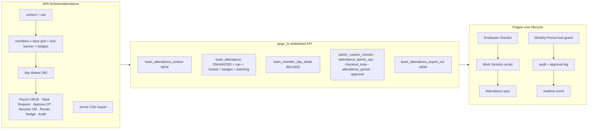
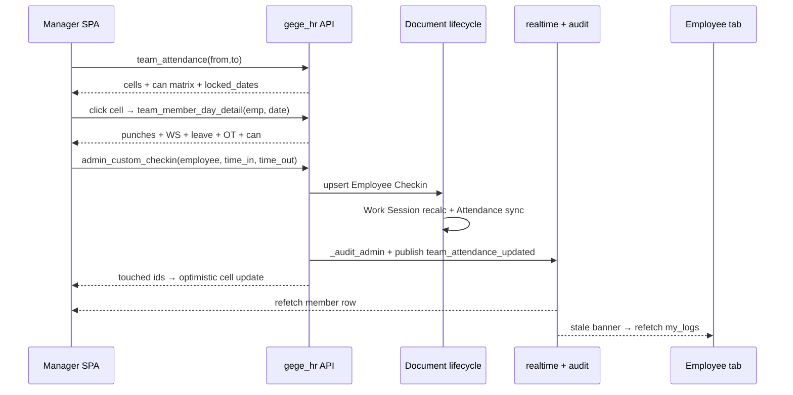

# Plan — Desk-free `/hr/team/attendance` (Team Attendance Command Center)

> Companion to `plans/plan-team-schedule-desk-free.md` (team schedule) and the
> Team-Today endpoints in `gege_hr/api/attendance.py`.
> Goal: a manager/HR opens `/hr/team/attendance` and can **view matrix → open
> day drawer 360° → fix punches → mark attendance → create requests → approve
> OT/corrections → resolve checkout-miss → recalc → lock period → export →
> audit** without ever opening the Desk.

---

## 1. Goals & non-goals

**Goals**

1. **Server-driven capability matrix** — every day-cell carries a `can` block
   computed from role + scope + lock state + day state. FE renders buttons from
   the matrix only ("BE là nguồn sự thật duy nhất", same principle as
   `attendance.team_day_can` / plan-team-schedule WP3).
2. **Day-cell drawer 360°** — click any cell → full context for that
   (employee, day): raw punches, Work-Session metrics, leave, OT, pending
   requests, checkout-miss, shift meta, activity — reuse
   `attendance.team_member_day_detail()`.
3. **Complete punch lifecycle in-page** — fix IN/OUT (exists via
   `admin.admin_custom_checkin`), plus list / create / edit / **delete** stray
   punches (`attendance_admin_ops.list/create/update/delete_checkin`).
4. **Mark attendance** (Frappe *Employee Attendance Tool* parity) — per-cell
   menu Present/Absent/Half Day/Work From Home + multi-select bulk; Line
   Manager unlocked on own `reports_to` team.
5. **Inline request creation** — Tạo giải trình / Tạo nghỉ phép / Tạo OT as
   in-page modals (no new tab), pre-filled employee + work_date.
6. **Approval inbox strip** — per-member pending badges (corrections / OT /
   leave / checkout-miss) + inline approve/reject via the existing unified
   approval center (`approval.approve_request` / `reject_request`) and
   `attendance_admin_ops.approve_session_overtime`.
7. **Period-lock awareness** — grid knows `locked_dates`, renders read-only
   cells + lock banner, deep-links to period close/confirm/lock/unlock.
8. **Engine actions** — "Tính lại ngày" (`recalculate_work_session`),
   "Sinh công / backfill" (`generate_attendance`), "Tính lại kỳ"
   (`recalculate_period`).
9. **Data out** — server-side CSV export (UTF-8 BOM) of the whole grid range.
10. **Realtime** — every mutation publishes `gege_hr:team_attendance_updated`
    → open tabs refetch the affected member row / show a stale banner.
11. **Performance** — kill the N+1 in `team_attendance()` (per-member
    Attendance + Work Session loops → batched window queries); server-side
    search/filter/paging; window clamp.

**Non-goals (this phase)**

- Shift master / assignment editing (already desk-free on `/hr/team/schedule`
  — link out).
- Payroll / payslip flows (own page).
- Device (machine) import management (own page).
- Drag-and-drop cell UX.

---

## 2. Current state & gap analysis

| Piece | Where | Gap |
|---|---|---|
| Matrix read | `attendance.team_attendance()` `attendance.py:1967` | read-only; **N+1** (per-member `Attendance` loop at :2150 + per-member Work-Session loop at :2167); no `can` matrix; no lock flags; no pending badges; no server-side search/filter/paging; no window clamp |
| Context/options | — | none (`team_schedule_context` pattern not ported) |
| Day detail | `attendance.team_member_day_detail()` `attendance.py:1818` (Team-Today) | exists, reusable for any date; not wired to this page |
| Cell `can` | `attendance.team_day_can()` `attendance.py:1739` | exists for Team-Today drawer only; nothing for the range grid |
| Punch fix | `admin.admin_custom_checkin()` `admin.py:3612` | wired via `CheckinEditModal.vue`; gate `_require_attendance_editor_for` `admin.py:3474` (HR + LM-of) is the pattern to reuse |
| Punch CRUD | `attendance_admin_ops.list/create/update/delete_checkin` (:383/:436/:494/:552) | exist, HR-only (`_require_hr` → `HR_ROLES` = HR Manager/HR User/System Manager, :42); **not wired**; LM blocked |
| Mark attendance | `attendance_admin_ops.mark_attendance_bulk()` :630 | exists (E7), HR-only, overwrite flag; **not wired** |
| Generate/backfill | `attendance_admin_ops.generate_attendance()` :585, `attendance_sync.backfill_attendance()` :214 | exist; **not wired** |
| OT approve | `attendance_admin_ops.approve_session_overtime()` :727 | exists (E8, HR Manager/SM only); **not wired** |
| Corrections | `attendance.submit_correction_request()` :3185; unified `approval.approve_request/reject_request` | create+approve desk-free elsewhere; **not wired into grid**; on-behalf creation needs verify |
| Leave create | `leave.apply()` `leave.py:392` (manager may act for anyone) | desk-free; grid quick-action currently opens a **new tab** |
| Checkout-miss | `checkout_miss.resolve_checkout_miss()` :409, `_team_checkout_miss_by()` `attendance.py:1630` | desk-free page exists; **no badge/resolve from grid** |
| Period lock | `attendance_period.*` (periods :241, confirm_line :527, lock :670, unlock :767) | desk-free page exists; grid has **no lock awareness** (mutation 403s late) |
| Recalc | `attendance.recalculate_work_session()` :2842, `recalculate_period()` :2895 | exist; **not wired** |
| Nudge | `attendance.nudge_team_member()` :1856 | exists (Team-Today); **not wired** |
| Export | FE-only Excel (`useTeamMatrix.buildExportRows`) | no server CSV parity (`export_team_day_csv` pattern :1923) |
| Realtime | `_publish_team_today()` :1681 (`gege_hr:team_today`) | grid mutations don't publish a team-attendance event |
| Audit | `_audit_admin`, VN Audit Event, VN Approval Log | exist; no read endpoint for the day drawer |
| Tests | `tests/test_team_today.py`, `test_attendance_admin_ops.py`, `test_hardening.py` | no TA-cases for grid `can`/lock/badges/batching/LM gates |

---

## 3. Architecture decisions (Frappe-standard)

1. **API-only surface.** SPA → `frappe.call()` → `@frappe.whitelist()` methods
   in `gege_hr/api/attendance.py` (reads + grid) and the existing mutation
   modules (`admin.py`, `attendance_admin_ops.py`, `checkout_miss.py`,
   `attendance_period.py`, `approval.py`). No new doctypes.
2. **Server-driven capability matrix.** `team_attendance_context()` returns the
   viewer `can.*`; `team_attendance()` returns **per-day-cell** `can.*`
   computed by a pure helper `_team_att_cell_can(role, scope, locked, day_state,
   ws_state)` (unit-testable, mirrors `team_day_can()` at `attendance.py:1739`).
3. **Document lifecycle for writes.** All mutations keep going through
   `insert()/save()/submit()/cancel()` or the existing audited endpoints —
   no new raw `db.set_value` paths. Lock guards stay (`_is_date_locked` /
   `_guard_writable_date`).
4. **Line Manager scope.** Reuse the `_require_attendance_editor_for(employee)`
   pattern (`admin.py:3474`): HR Manager/System Manager/HR User = company-wide;
   Line Manager = only employees whose `reports_to` is the caller. Bulk
   endpoints stay partial-safe (per-row `{ok|error}` result lists, pattern
   `bulk_end_shift_assignments`).
5. **Batched reads.** Grid = fixed number of windowed queries per request
   (1× members, 1× Shift Assignment span, 1× Attendance span, 1× Work Session
   span, 1× Leave Application span, 1× pending counts, 1× checkout-miss open,
   1× locked periods) — never per-member loops. Window clamp: default 31 days,
   max 62 (week-view rolls into next month).
6. **Role model.**

   | Role | grid read | fix/delete punch | mark bulk | create request on-behalf | approve OT | approve corrections/leave | lock/unlock period | recalc/backfill | export | nudge |
   |---|---|---|---|---|---|---|---|---|---|---|
   | Employee | — (own view lives elsewhere) | — | — | — | — | — | — | — | — | — |
   | Line Manager | own `reports_to` | own team | own team | own team | — (unless holds OT approver role) | via unified approval center scope | — | — | own team | own team |
   | HR User | company | ✅ | ✅ | ✅ | — | via approval center | read lock logs | ✅ | ✅ | ✅ |
   | HR Manager / SM | company | ✅ | ✅ | ✅ | ✅ | ✅ | ✅ | ✅ | ✅ | ✅ |

   (Locked days: all mutation flags false for every role.)

7. **Realtime contract.** New best-effort event
   `gege_hr:team_attendance_updated {employee, work_date}` published by the
   mutation endpoints that already recalc Work Sessions
   (`admin_custom_checkin`, `create/update/delete_checkin`,
   `mark_attendance_bulk`, `approve_session_overtime`,
   `resolve_checkout_miss`, `recalculate_work_session`). SPA subscribes and
   refetches the affected member row (pattern `_publish_team_today` :1681).



---

## 4. Work packages

### WP1 — `team_attendance_context(from_date, to_date)`  · P0  (`attendance.py`)

```
GET team_attendance_context
→ {
  "viewer_employee": "HR-0001" | null,
  "scope": {"mode": "team"|"company", "member_count": 12},
  "can": {
    "view_grid": true, "fix_punch": true, "delete_punch": true,
    "mark_attendance": true, "create_request": true, "approve_ot": false,
    "resolve_checkout_miss": true, "recalc": true, "generate": true,
    "nudge": true, "export": true, "manage_period": false
  },
  "period": {"name": "MAP-2026-09", "status": "Draft"|"Locked"|null},
  "locked_dates": ["2026-08-31"],
  "pending_approvals": {"corrections": 2, "overtime": 1, "leaves": 0,
                        "checkout_misses": 3},          // within viewer scope
  "filters": {"shift_types": [...], "departments": [...]},
  "window": {"from_date": "...", "to_date": "...", "max_days": 62}
}
```
- Gate: same `only_for` as `team_attendance` (HR Manager/HR User/System
  Manager/Line Manager). Plain Employee → `PermissionError`.
- `locked_dates` from `VN Monthly Attendance Period` rows overlapping the
  window (Locked status) — one query.
- `pending_approvals` reuses `_team_pending_counts` + `_team_checkout_miss_by`
  (window-filtered) + a Draft-count query for corrections/OT/leave in scope.
- `can.approve_ot` = caller has an `OT_APPROVER_ROLES` role;
  `can.manage_period` = HR Manager/System Manager (parity
  `attendance_period._assert_closer`).

### WP2 — `team_attendance(...)` enhanced  · P0  (`attendance.py:1967`)

New kwargs (all optional, backward compatible): `search`, `status_filter`
(cell token), `shift_type`, `page=1`, `page_size=60`.

Response **additions** (existing keys `from_date/to_date/groups/members/summary`
unchanged — SPA regression-safe):

```
{
  ...,
  "locked_dates": [...],
  "period": {...},                       // as context
  "members": [ { ..., "pending": {"corrections":1,"overtime":0,"leaves":0,
                                   "checkout_misses":1},
                 "days": [ { ...,          // existing day fields verbatim
                   "locked": false,
                   "work_session": "VAWS-0012" | null,
                   "open_checkout_miss": "VCM-0007" | null,
                   "can": { "view_detail": true, "fix_punch": true,
                            "delete_punch": false, "mark_attendance": true,
                            "create_request": true, "approve_ot": false,
                            "resolve_checkout_miss": false, "recalc": true,
                            "nudge": true } } ] } ]
}
```

Rules:
- **Pure helper** `_team_att_cell_can(*, is_hr, is_lm_of, locked, is_future,
  has_punch, raw_ot, open_cm, is_ot_approver)` — no DB, unit-testable:
  - `locked` → all mutation flags false (every role);
  - `is_future` → `fix_punch/delete_punch/mark_attendance/create_request` false;
  - `approve_ot` = `is_ot_approver and raw_ot > 0`;
  - `resolve_checkout_miss` = `is_hr and open_cm and not locked`;
  - LM → true only for own `reports_to` members (scope precomputed per member).
- **Batching fix**: replace the per-member loops (:2150 Attendance, :2167 Work
  Session) with two windowed `["in", emps]` queries, then group in Python.
  Membership/roster logic (primary_shift, att_shifts) untouched.
- Server-side `search` (employee_name / employee / designation) and
  `status_filter` over derived day tokens; `page/page_size` over members
  (`page_size` clamp 10–200).
- Window clamp: `(end - start).days > 62` → `ValidationError`.
- Week-view cross-month days: extend `end` to the week boundary before
  querying (FE already renders `inMonth=false` cells).

### WP3 — Day-cell drawer (SPA)  · P0

- New `TeamDayDrawer.vue`; data from `attendance.team_member_day_detail(
  employee, date_str)` (`attendance.py:1818` — verify it works for any past
  date, not just today; it wraps `_day_detail_core` :1242 which is date-based).
- Sections: shift meta + planned window; raw punches (time, log type, source);
  WS metrics (late/early/OT raw vs approved, missing/auto-checkout flags);
  leave block; pending requests (correction/OT/leave) with links; checkout-miss
  ticket block; actions rendered from the cell `can` matrix only.
- `CheckinEditModal` stays for the quick fix-punch flow (opened from drawer or
  cell click) — unchanged contract.

### WP4 — Punch CRUD + mark + generate wiring  · P1  (`attendance_admin_ops.py` + SPA)

- Drawer "Lượt chấm" tab calls `list_checkins(employee, from, to)`; each row:
  edit (prefills CheckinEditModal via `update_checkin`) / delete with mandatory
  reason (`delete_checkin`) / add (`create_checkin`).
- **LM scope**: extend `_require_hr()` call-sites in `list_checkins`,
  `create_checkin`, `update_checkin`, `delete_checkin` to a new
  `_require_hr_or_lm_of(employee)` helper (copy semantics of
  `_require_attendance_editor_for`, `admin.py:3474`). `generate_attendance`
  stays HR-only.
- Cell menu "Đánh dấu công" → Present/Absent/Half Day/Work From Home
  (`mark_attendance_bulk`, `overwrite` checkbox when a row exists). Grid
  multi-select (member checkboxes × current column) → same endpoint,
  partial-safe rendering of `results`.
  - `mark_attendance_bulk` gate: add LM path — per-row check `reports_to ==
    caller` (foreign rows → `{"ok": false, "error": ...}`, never aborts the
    batch).
- Toolbar "Sinh công" (HR) → `generate_attendance(from, to)` fills Not-marked
  days; result toast `synced/skipped`.

### WP5 — Inline request creation  · P1  (SPA + small BE verify)

- Replace the new-tab quick-actions in `CheckinEditModal.vue` with in-page
  modals:
  - Tạo giải trình → `attendance.submit_correction_request(**{employee,
    work_date, ...})` — verify on-behalf creation for HR/LM is allowed; if the
    endpoint forces caller-employee, add explicit `on_behalf_manager` branch
    gated by `_require_attendance_editor_for` (no new doctype logic).
  - Tạo nghỉ phép → `leave.apply(**{employee, from_date, to_date, ...})`
    (manager path already permitted by `leave._assert_own`).
  - Tạo OT → `overtime.submit_overtime_request(**{employee, ...})` (verify
    same-manager bypass; same treatment if missing).
- All three pre-filled from the clicked cell; on success → badge refresh +
  realtime event.

### WP6 — Approval inbox strip  · P1  (SPA, BE exists)

- Member-row badges from the new `pending` block (corrections / OT / leave /
  checkout-miss) — click → slide-over list (reuse the unified approval center
  payloads `approval.get_pending_approvals`, `approval.get_request_detail`)
  with inline `approve_request` / `reject_request` / `return_request`.
- OT chip (🌙, `raw_overtime_hours > 0 && approved == 0`) on cell/drawer →
  approve modal → `attendance_admin_ops.approve_session_overtime(work_session,
  hours?, note)` (cap `min(hours, raw)` already enforced server-side).

### WP7 — Checkout-miss + period lock UX  · P1  (SPA, BE exists)

- Cell with `open_checkout_miss` → icon 🚪❓ + drawer block: ticket meta,
  "Xử lý" → `checkout_miss.resolve_checkout_miss(name, resolution_type,
  note, ...)`; bulk strip for many tickets → `bulk_resolve_checkout_misses`.
- Lock banner: when `period.status == "Locked"` or any `locked_dates` intersect
  the window → amber banner "Kỳ công đã khóa — ô chỉ đọc" + (HR Manager)
  buttons: `confirm_all_monthly_lines` → `lock_monthly_period`,
  `unlock_monthly_period` (reason required) — FE contracts already exist in
  `attendance.py:3334–3377`.

### WP8 — Recalc + nudge actions  · P1  (SPA, BE exists)

- Drawer "⋯" menu: "Tính lại phiên này" → `recalculate_work_session(work_session)`
  (HR); "Tính lại kỳ" → `recalculate_period(from, to)` (HR Manager);
  "Nhắc nhở" → `nudge_team_member(employee, date_str, kind)` (LM/HR).
- Each posts a toast + triggers grid refetch of that member row.

### WP9 — Data out + realtime  · P2

- `team_attendance_export_csv(from_date, to_date, search, status_filter,
  shift_type)` → `{"filename": "team-attendance-2026-09.csv", "csv": BOM +
  rows, "rows": n}` — mirrors `export_team_day_csv` (:1923) but walks the same
  enhanced grid builder (WP2) so export == what the manager sees. Gate: HR or
  LM (own team), audited like `export_blackout_csv`.
- `_publish_team_attendance(employee, work_date)` helper in `attendance.py`
  (copy `_publish_team_today` :1681, event `gege_hr:team_attendance_updated`);
  called (best-effort) from: `admin_custom_checkin`, `create/update/delete_
  checkin`, `mark_attendance_bulk`, `approve_session_overtime`,
  `resolve_checkout_miss`, `recalculate_work_session`.
- SPA: `useHrRealtime` subscribes; on event → refetch single member row
  (`team_attendance(..., employees=[emp]` optional filter param) or full reload
  when window changed; stale banner while refetching.

### WP10 — Tests, hardening, docs  (all phases)

See §5–§6. README endpoint table + this file linked from `attendance.py`
module docstring (B-case style).

---

## 5. Test cases

### 5.1 Bench-free unit tests — NEW `tests/test_team_attendance_deskfree.py`
(harness `_FakeDB` pattern from `test_schedule_deskfree.py` / `test_team_today.py`; reuse stub maps for Attendance / Work Session / Leave / Checkin / Period rows)

| ID | Case | Expectation |
|---|---|---|
| TA1 | `team_attendance_context` as Line Manager | `scope.mode="team"`, `can.fix_punch=true`, `can.approve_ot=false` |
| TA2 | context as plain Employee | `PermissionError` |
| TA3 | context as HR Manager | `scope.mode="company"`, `can.mark_attendance=true`, `can.manage_period=true` |
| TA4 | context with a Locked period overlapping | `locked_dates` populated, `period.status="Locked"` |
| TA5 | context `pending_approvals` | counts only in-scope rows (seed 2 own + 1 foreign → 2) |
| TA6 | `team_attendance` batching | fake-db call log has exactly 1 windowed query per doctype — no per-member loop |
| TA7 | `team_attendance(search=...)` | matches employee_name; foreign members excluded |
| TA8 | cell `can` — locked date | every mutation flag false (all roles) |
| TA9 | cell `can` — future date | `fix_punch=false`, `create_request=false`, `nudge` still true |
| TA10 | cell `can` — LM on foreign member | all manage flags false |
| TA11 | member `pending` badges present | corrections/OT/leave/checkout-miss counts match seeds |
| TA12 | legacy response shape | `groups/members/summary` keys + day fields byte-identical to pre-change fixture (regression) |
| TA13 | `mark_attendance_bulk` as LM own team | rows ok; Attendance docs created |
| TA14 | `mark_attendance_bulk` as LM mixed team | own rows ok, foreign row `{"ok": false}` — batch not aborted |
| TA15 | `delete_checkin` as LM own team | ok + audit row + recalc called |
| TA16 | `delete_checkin` on locked date | `ValidationError` (lock guard intact) |
| TA17 | `approve_session_overtime` as HR User | `PermissionError` (OT approver roles unchanged) |
| TA18 | cell `can.approve_ot` | HR Manager + `raw_ot>0` → true; `raw_ot=0` → false |
| TA19 | cell `open_checkout_miss` | badge + `can.resolve_checkout_miss=true` (HR, unlocked) |
| TA20 | `team_attendance_export_csv` as Employee | `PermissionError` |
| TA21 | `team_attendance_export_csv` content | UTF-8 BOM header + one row per member, late/early/OT cells match grid |
| TA22 | realtime publish | stub `frappe.publish_realtime` called with `gege_hr:team_attendance_updated` after `admin_custom_checkin` |
| TA23 | `recalculate_work_session` as LM foreign | `PermissionError` |
| TA24 | `team_member_day_detail` on a past date | returns 360° payload (drawer reuse valid beyond today) |
| TA25 | window clamp | 63-day range → `ValidationError` |
| TA26 | paging | `page_size` clamp + member slicing |
| TA27 | `submit_correction_request` on-behalf (manager) | allowed for HR/LM-of; Employee-for-other → `PermissionError` |
| TA28 | week-view roll-over | window extended to week boundary; `inMonth=false` days carry data |

### 5.2 Hardening — append rows to `tests/test_hardening.py` role×endpoint table

`team_attendance_context`, `team_attendance` (new kwargs), `team_attendance_
export_csv`, LM paths of `mark_attendance_bulk` / `delete_checkin` /
`update_checkin` — spoof vectors: forged `manager=`/`employee=` params, role
escalation via payload, locked-date writes.

### 5.3 Bench smoke — NEW `e2e_ops.py::team_attendance_deskfree_smoke()`

1. Seed: LM user+employee, 2 members (`reports_to` = LM), shift type +
   assignments, checkins for 3 days, one raw-OT session, one open
   checkout-miss, Draft correction.
2. `frappe.set_user(lm)` → context asserts (scope=team, badges=2).
3. `team_attendance(month)` → 2 members × days; assert cell `can` matrix and
   batching (single query per doctype via debug counter).
4. `admin_custom_checkin` fix IN → refetch grid → cell time updated.
5. `mark_attendance_bulk` Absent member B → cell status Absent.
6. `frappe.set_user(hr_manager)` → `approve_session_overtime` → chip data
   `approved_overtime_hours > 0`.
7. Negative: LM `delete_checkin` on foreign employee → assert `PermissionError`.
8. `lock_monthly_period` → grid cells `locked=true`, `can` all-false;
   `unlock_monthly_period` → editable again.
9. `team_attendance_export_csv` → row count == members.
10. Print `ASSERT:` lines for every step (existing smoke style).

### 5.4 Browser e2e — NEW `trader-ui/tests-e2e/team-attendance-deskfree.mjs`

HR login → matrix renders → open drawer → fix punch → toast + cell refresh →
mark modal → multi-select bulk mark → OT chip approve → lock banner read-only
→ realtime stale banner (second tab mutation) → CSV download.

---

## 6. Step-by-step implementation checklist

> **STATUS: HOÀN TẤT 2026-09-07** — mọi bước dưới đây đã chạy xanh:
> 2077 unit tests BE (29 test TA mới) · bench smoke `team_attendance_deskfree_smoke`
> OK trên `erp-hr.local` · SPA build+deploy (`trader-ui/dist`, nginx root) ·
> browser e2e `trader-ui/tests-e2e/team-attendance-deskfree.mjs` **6/6**
> (chạy: `E2E_BASE=http://erp-hr.local node tests-e2e/team-attendance-deskfree.mjs`,
> user `hr.e2e@gege.test` / `HrE2e!234` đã seed HR Manager trên site).

Order matters; each step ends with a green verification command.

1. **WP2 pure helper first** `_team_att_cell_can` (no DB) + unit tests TA8–TA10, TA18.
   ✅ `python -m pytest tests/test_team_attendance_deskfree.py -k "TA8 or TA9 or TA10 or TA18" -q`
2. **WP2 grid enhancement**: batching + locked_dates + pending badges + search/
   paging + clamp; regression fixture TA12.
   ✅ `... -k "TA6 or TA7 or TA11 or TA12 or TA25 or TA26 or TA28"`
3. **WP1 context endpoint** + filter loaders.
   ✅ `... -k "TA1 or TA2 or TA3 or TA4 or TA5"`
4. **WP4 BE gates**: `_require_hr_or_lm_of` + per-row LM scope in
   `mark_attendance_bulk`; drawer feeds (`list_checkins` reuse).
   ✅ `... -k "TA13 or TA14 or TA15 or TA16"`
5. **WP5 on-behalf verify/patch** for correction/overtime submit; TA27.
   ✅ `... -k "TA27"`
6. **WP9 realtime + export**: `_publish_team_attendance` wired into the 7
   mutation sites; `team_attendance_export_csv`.
   ✅ `... -k "TA20 or TA21 or TA22"`
7. **Day-detail reuse check** TA24 (no BE change expected).
   ✅ `... -k "TA24"`
8. **Hardening matrix update** → `python -m pytest tests/test_hardening.py -q`
9. **Full unit suite** → `python -m pytest tests/ -q` (all green).
10. **Bench smoke** on dev site →
    `bench --site <site> execute gege_hr.gege_hr.tests.e2e_ops.team_attendance_deskfree_smoke`
11. **SPA WP3–WP8** (trader-ui, separate PR): drawer, badges, inline modals,
    mark menu, lock banner, recalc/nudge menu, export button, realtime refetch
    (`useTeamMatrix.js` consumes `can`/`locked_dates`; delete FE-side
    editability guessing in `deriveCellMeta`).
12. **Browser e2e** part TA (§5.4) → `node tests-e2e/team-attendance-deskfree.mjs`.
13. **Docs**: README endpoint table + link this file from `attendance.py`
    docstring + changelog entry.

---

## 7. Sequence — manager fixes a missing punch from the grid



---

## 8. Risks & mitigations

| Risk | Mitigation |
|---|---|
| Grid payload grows (60 members × 31 days × can-block) | trim `can` to 9 booleans; day dict stays flat; paging + window clamp 62d; measure payload in smoke |
| LM scope bypass (forged `employee=`/`manager=`) | scope re-derived server-side every request (pattern :1987 IDOR fix); hardening rows §5.2 |
| Lock race (cell edited while period locks) | server `_guard_writable_date` is the final gate — FE `can` is advisory only; realtime event narrows the window |
| Batching regression shifts cell truth | keep the per-day derivation code identical, only the row-fetch becomes batched; TA12 golden fixture |
| Legacy SPA contract break | response is strictly additive; old fields verbatim; deploy BE before FE |
| `team_member_day_detail` assumes "today" semantics | TA24 proves date-parameterised reuse before the SPA builds on it |
| On-behalf creation endpoints refuse managers | WP5 step 5 gates + patches only after TA27 proves the gap; no silent permission widening |
| Export ≠ grid (drift) | export calls the same grid builder (single source of truth) |
