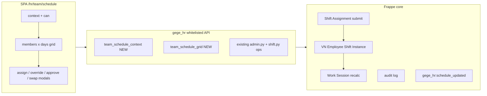
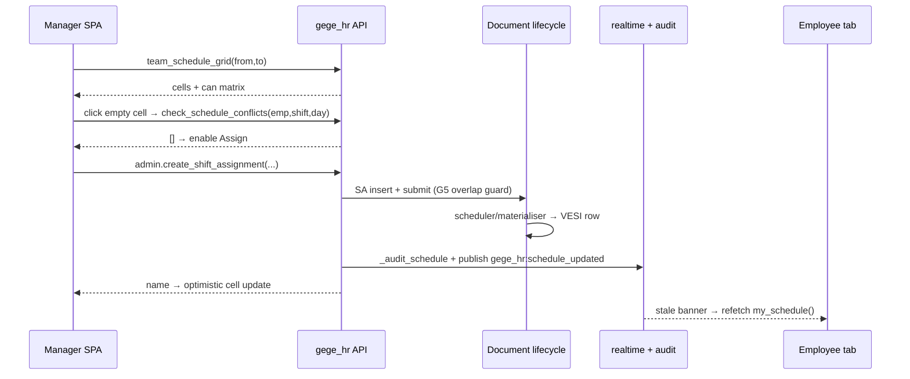

# Plan — Desk-free `/hr/team/schedule` (Team Schedule Command Center)

> Companion to `plans/plan-schedule-desk-free.md` (the personal `/hr/schedule` view).
> Goal: a manager/HR opens `/hr/team/schedule` and can **view → detect conflicts →
> assign / override / approve → audit → realtime-propagate** without ever opening
> the Desk.

---

## 1. Goals & non-goals

**Goals**
1. Team grid = **batched, server-driven** read (one round-trip: members × days,
   cell-level truth from `VN Employee Shift Instance`, leave/OT chips, coverage gaps).
2. Every mutation available from the grid is a **whitelisted method with a
   server-computed `can` matrix** — FE renders buttons from the matrix only
   (same principle as `attendance.team_day_can`, "BE là nguồn sự thật duy nhất").
3. Line Manager unblocked on their own team (today `team_schedule()` 403s them).
4. Approvals (Shift Request approve/reject) reachable from the team page.
5. Audit + realtime + notifications fire on every mutation (existing helpers).

**Non-goals (this phase)**
- Shift Type master editing UI (already desk-free via `/hr/employees` gear; link out).
- Drag-and-drop UX (P2; endpoints designed to support it later).
- Multi-company matrix management.

---

## 2. Current state & gap analysis

| Piece | Where | Gap |
|---|---|---|
| `team_schedule()` | `gege_hr/api/shift.py:151` | read-only; **`Line Manager` missing from `only_for`** (yet it *is* in `SCHEDULE_MANAGER_ROLES` at `shift.py:176`); direct reports only; **N+1** (calls `my_schedule()` per member); derives from `Shift Assignment` only — ignores materialised `VN Employee Shift Instance` status (Skipped/Cancelled), leave, OT, coverage gaps |
| Team scope | — | no `_team_scope_members()` equivalent in shift context (attendance has one at `attendance.py:1710` via `team_daily_status`) |
| Action matrix | `attendance.team_day_can()` `attendance.py:1739` | pattern exists for Team Today; **nothing for schedule cells** |
| Mutations | `admin.py` 2169–3110 | all exist (create/amend/end/override/bulk/approve/reject/recurring) but **not composed for a grid**, and gated `_require_hr_admin()` → HR roles only; LM cannot act on own team |
| Conflict preview | `admin.check_schedule_conflicts()` `admin.py:2636` | exists; needs cell-level pre-wire |
| Realtime | `_notify_schedule_updated()` `shift.py:229`, `_notify_schedule_updated_admin()` `admin.py:170` | event `gege_hr:schedule_updated` already published; SPA just subscribes |
| Audit | `_audit_schedule()` `shift.py:198` / `_audit_admin()` `admin.py:144` | exists; no read endpoint for the team page drawer |
| Tests | `tests/test_schedule_deskfree.py` (B1–B20), `tests/test_hardening.py`, `tests/e2e_ops.py::schedule_deskfree_smoke` | no C-cases for team endpoints |

---

## 3. Architecture decisions (Frappe-standard)

1. **API-only surface.** SPA → `frappe.call()` → `@frappe.whitelist()` methods in
   `gege_hr/api/shift.py` (team reads) and `gege_hr/api/admin.py` (mutations).
   No portal-page python templates; the SPA lives in `trader-ui` (out of repo).
2. **Server-driven capability matrix.** `team_schedule_context()` returns viewer
   `can.*`; `team_schedule_grid()` returns **per-cell** `can.*` computed from role +
   day state (past days read-only; locked periods read-only; instance Active/Completed
   immutable — mirrors `set_shift_instance_status()` rules at `shift.py:618`).
3. **Document lifecycle for writes.** All mutations keep going through
   `insert()/save()/submit()/cancel()` so `validate` hooks (e.g.
   `sync_native_shift_windows()` `shift.py:35`) and the G5 overlap guard stay in force.
   New composition endpoints (`swap_shift_days`, `copy_week_schedule`) **reuse**
   `create_shift_assignment` / `end_shift_assignment` / `override_day_shift_assignment`
   internally — no raw `db.set_value`.
4. **Batched reads.** Grid = fixed number of queries per request (members,
   SAs, instances, leave, OT, pending SRs, audit-free) — never per-member loops.
   Windows capped (default 7 days, max 31) to bound cell count.
5. **Role model.**

   | Role | team_schedule_context/grid | assign/override/end/amend | approve/reject SR | bulk/recurring | export |
   |---|---|---|---|---|---|
   | Employee | own row only (via `/hr/schedule`) | — | — | — | — |
   | Line Manager | own `reports_to` scope | own team only | if configured approver of that employee | — | own team |
   | HR User / HR Manager / SM | department/company scope | ✅ | ✅ | ✅ | ✅ |

6. **Realtime contract.** every successful mutation already publishes
   `gege_hr:schedule_updated {employee}` — grid subscribes and refetches the
   affected member row (or shows a stale banner).



---

## 4. Work packages

### WP1 — Role gate + team scope (`shift.py`)  · P0

- Change `team_schedule()` `only_for` → `SCHEDULE_MANAGER_ROLES` (adds Line Manager).
- Add `_team_scope_members(manager_emp, is_hr)`:
  - HR roles → Active Employees of default company (optionally `department` filter);
  - Line Manager → Active Employees with `reports_to = manager_emp`
    (copy semantics from `attendance._team_scope_members`, `attendance.py:1710`).
- Add `_is_hr_schedule_role()` helper (`HR Manager`/`HR User`/`System Manager`).
- Keep the legacy `team_schedule()` working (thin wrapper over the new grid for
  backward compatibility with any deployed SPA call) — deprecated in docstring.

### WP2 — `team_schedule_context(from_date, to_date)`  · P0

```
GET team_schedule_context
→ {
  "viewer_employee": "HR-0001" | null,
  "scope": {"mode": "team"|"company", "member_count": 12},
  "can": {
    "view_grid": true, "assign": true, "override_day": true, "end": true,
    "amend": true, "approve_requests": true, "bulk": false, "export": true
  },
  "pending_approvals": {"count": 3, "link": "team_shift_requests?status=Draft"},
  "filters": {
    "shift_types":  [{value,label,description}],        // reuse shift_type_options()
    "work_locations": [{value,label}],
    "departments":  [{value,label}]
  },
  "window": {"from_date": "...", "to_date": "...", "max_days": 31}
}
```
- Errors: `PermissionError` for plain Employee (they belong on `/hr/schedule`).
- `pending_approvals.count` counts Draft Shift Requests **within the viewer's scope**
  (LM: own team only — see WP4).

### WP3 — `team_schedule_grid(...)`  · P0/P1

```
GET team_schedule_grid(from_date, to_date, search?, department?, shift_type?,
                       location?, coverage?=unassigned|all, page=1, page_size=50)
→ {
  "from_date": "...", "to_date": "...", "locked_dates": ["..."],
  "summary": {"members": 12, "unassigned_days": 4, "pending_requests": 3},
  "members": [
    {
      "employee": "HR-0007", "employee_name": "Nguyen Van A",
      "department": "Sales", "pending_requests": 1,
      "days": [
        {
          "date": "2026-09-07",
          "shift_type": "Morning", "window": "08:00–17:00", "is_overnight": false,
          "instance": "VESI-0009", "instance_status": "Scheduled"|"Skipped"|"Cancelled"|"Active"|"Completed"|null,
          "shift_assignment": "SA-0012",
          "work_location": "HN-01", "work_location_name": "Hà Nội",
          "leave": {"type": "Annual Leave", "half_day": false} | null,
          "ot_hours": 2.0,
          "can": {"override": true, "skip": true, "amend": true, "end": true,
                  "view_detail": true, "approve": false}
        }, ...
      ]
    }
  ]
}
```
Rules:
- **Batched queries only**: 1× members (paged), 1× SA spanning window, 1× VESI
  (`work_date` between), 1× approved Leave Applications, 1× approved OT work
  sessions, 1× Draft Shift Requests. Overlap expansion done in Python.
- **Cell truth order**: VESI status (Skipped/Cancelled beat SA) > SA window >
  Leave chip > OT chip; empty cell + working day (non-weekend per shift policy)
  → `unassigned` marker for coverage gap filter.
- **`can` matrix per cell** (pure helper `_grid_cell_can(role, day_state, locked,
  is_lm_of, instance_status)` — unit-testable, mirrors `team_day_can()`):
  - past dates or `locked_dates` → all mutations false;
  - `instance_status ∈ {Active, Completed}` → mutations false (engine-owned, parity
    with `set_shift_instance_status()` refusal at `shift.py:618`);
  - LM → true only for own `reports_to` members;
  - `approve` true only when that member has a Draft SR overlapping the date.
- Window clamp: >31 days → `ValidationError`.

### WP4 — LM-scoped approvals  · P0

- `admin.list_shift_requests()`: add `scope="team"` param — Line Manager sees only
  Draft SRs of own `reports_to` members (verify against `_team_scope_members`);
  HR unchanged. Keep `_require_hr_admin()` for HR path; LM path gates per-row scope.
- `approve_shift_request()` / `reject_shift_request()`: accept LM **only when**
  `frappe.session.user` is the SR's configured `approver` or LM-of-that-employee;
  otherwise `PermissionError`. (Approve already creates + submits the linked SA —
  G9 parity, keep.)

### WP5 — Composition endpoints  · P1

- `swap_shift_days(instance_a, instance_b)` → validates both cells are future,
  unlocked, same-company, different employees; then two
  `override_day_shift_assignment()` calls inside one request; single audit row
  `Hoán đổi ca ...`; returns `{created, adjusted, cancelled}` unions. Any failure →
  whole request rolls back (Frappe transaction semantics).
- `copy_week_schedule(from_week_start, to_week_start, employees[])` → for each
  employee × day with an SA in source week: create same shift on target day
  (conflict-guarded per cell, partial-safe result rows). Enqueued via
  `frappe.enqueue(..., queue="short")` when `employees` > 5; returns job id for
  SPA polling (pattern: `on_shift_instance_submit()` enqueue at `shift.py:816`).

### WP6 — Data out  · P2

- `team_schedule_export(from_date, to_date, format="csv")` → streams the current
  grid rows as CSV attachment (HR/LM only, mirrors `export` flag of
  `team_day_can()`).
- `team_schedule_ics(employee, token)` → per-employee ICS of the next 60 days;
  token = `frappe.generate_hash()` stored on a Custom Field; read-only,
  no session needed (scope: one employee's own schedule).

### WP7–8 — Tests & smoke (see §5)

### WP9 — SPA wiring (trader-ui repo)

Contract = §4 responses verbatim. Grid subscribes
`gege_hr:schedule_updated` → refetch member row + stale banner. Modals call:
assign → `admin.create_shift_assignment`; day-override →
`admin.override_day_shift_assignment`; skip/undo → `shift.set_shift_instance_status`;
approve/reject → `admin.approve/reject_shift_request`; pre-flight →
`admin.check_schedule_conflicts`.

### WP10 — Docs

Update `README.md` endpoint table; cross-reference this file from
`shift.py` module docstring (like the B-case docstrings do).

---

## 5. Test cases

### 5.1 Bench-free unit tests — extend `tests/test_schedule_deskfree.py` (new C-cases; harness `_FakeDB2`/`_ShiftStub` reused, add VESI rows + leave/OT maps)

| ID | Case | Expectation |
|---|---|---|
| C1 | `team_schedule` as Line Manager | no 403; members = own `reports_to` only |
| C2 | `team_schedule` as plain Employee | `PermissionError` |
| C3 | HR Manager scope | sees company-wide members (not just reports_to) |
| C4 | `team_schedule_context` as LM | `can.assign=true`, `can.bulk=false`, `scope.mode="team"` |
| C5 | `team_schedule_context` plain Employee | `PermissionError` (redirect target `/hr/schedule`) |
| C6 | `pending_approvals.count` | counts only in-window Draft SRs of scope (seed 2 own + 1 foreign → 2) |
| C7 | `team_schedule_grid` batching | `db.calls` has exactly 1 query per doctype (no N+1) |
| C8 | grid cell truth — VESI Skipped overrides SA | `instance_status="Skipped"` displayed even with active SA |
| C9 | grid cell — leave chip | approved Leave Application → `leave.type` set, OT intact |
| C10 | coverage gap | working day without SA → `unassigned` + summary count |
| C11 | window clamp | 40-day window → `ValidationError` |
| C12 | cell `can` — past date | all mutation flags false |
| C13 | cell `can` — instance Active | mutation flags false (engine-owned) |
| C14 | cell `can` — LM foreign member | flags false for non-reports member |
| C15 | LM `scope="team"` on `list_shift_requests` | only own team's Draft SRs |
| C16 | LM approve foreign SR | `PermissionError` |
| C17 | configured approver (any role) approve | allowed; SA created + linked (G9) |
| C18 | `swap_shift_days` same employee | `ValidationError` |
| C19 | `swap_shift_days` happy path | 2 override calls, union result, 1 audit row |
| C20 | `copy_week_schedule` conflict mid-way | partial-safe: per-employee `{ok|conflict}` rows |
| C21 | `team_schedule_export` as Employee | `PermissionError` |
| C22 | `team_schedule_ics` bad token | `PermissionError` / 404 |

### 5.2 Hardening matrix — `tests/test_hardening.py`

Append every new method (`team_schedule_context`, `team_schedule_grid`,
`swap_shift_days`, `copy_week_schedule`, `team_schedule_export`, `team_schedule_ics`)
to the role×endpoint table so spoof attempts (foreign `employee=` params, role
escalation via payload) stay covered.

### 5.3 Bench smoke — extend `tests/e2e_ops.py::schedule_deskfree_smoke()` (§4.3 style)

1. Create throw-away LM user + employee chain (LM → 2 members) + shift types.
2. `frappe.set_user(lm)` → `team_schedule_context` asserts `can.assign`, scope=team.
3. `team_schedule_grid` week window → assert 2 members × 7 cells, batching ok.
4. Assign member A a shift via `create_shift_assignment` → grid refetch shows cell.
5. `override_day_shift_assignment` one day → cell shows new shift, VESI materialised.
6. Member B `create_my_shift_request` → LM `list_shift_requests(scope="team")`
   sees it → `approve_shift_request` → SA exists, SR approved.
7. Negative: LM tries member of another LM → `PermissionError` (assert raised).
8. Print `ASSERT:` lines for every step (matches existing smoke style).

### 5.4 Browser e2e (trader-ui `tests-e2e/schedule-deskfree.mjs` part C)

LM login → grid renders → assign modal → conflict popover → day override →
approve badge → realtime stale banner (second tab mutation).

---

## 6. Step-by-step implementation checklist

Order matters; each step ends with a green verification command.

1. **WP1 scope+gate** (`shift.py`): `_is_hr_schedule_role`, `_team_scope_members`,
   `only_for` fix, deprecate-and-wrap `team_schedule`.
   ✅ `python -m pytest tests/test_schedule_deskfree.py -k "C1 or C2 or C3" -q`
2. **WP2 context endpoint** + filter option loaders.
   ✅ `... -k "C4 or C5 or C6"`
3. **WP3 pure cell helper** `_grid_cell_can` (no DB) → unit tests C12–C14 first.
4. **WP3 grid endpoint** batched queries + overlays + clamp.
   ✅ `... -k "grid" ; -k "C7 or C8 or C9 or C10 or C11"`
5. **WP4 approvals scope**: `list_shift_requests(scope)` + approve/reject LM gate.
   ✅ `... -k "C15 or C16 or C17"`
6. **WP5 compositions**: `swap_shift_days`, then `copy_week_schedule` (+enqueue).
   ✅ `... -k "C18 or C19 or C20"`
7. **WP6 data-out**: export + ICS (+Custom Field patch for token via
   `patches.txt` if field missing).
   ✅ `... -k "C21 or C22"`
8. **Hardening matrix update** → `python -m pytest tests/test_hardening.py -q`
9. **Full unit suite** → `python -m pytest tests/ -q` (all green).
10. **Bench smoke** on dev site → `bench --site <site> execute gege_hr.gege_hr.tests.e2e_ops.schedule_deskfree_smoke`
11. **WP9 SPA** (trader-ui repo, separate PR) using §4 contract; browser e2e part C.
12. **WP10 docs**: README endpoint table + this file linked from `shift.py`
    docstring; changelog entry.

---

## 7. Sequence — manager assigns a shift from the grid



---

## 8. Risks & mitigations

| Risk | Mitigation |
|---|---|
| Grid payload explodes (50 members × 31 days) | window clamp 31d + paging members + day-cell dict trimmed to §4 fields |
| LM scope bypass (crafted `employee=`) | scope re-derived server-side every request; hardening matrix rows |
| Override-day race (two HR tabs) | G5 overlap guard inside `create_shift_assignment` already throws; realtime banner shortens the window |
| `copy_week_schedule` long run | enqueue >5 employees; partial-safe rows; heartbeat via WP4 health utils |
| Backward compat of legacy `team_schedule()` | kept as thin wrapper, same response shape |
